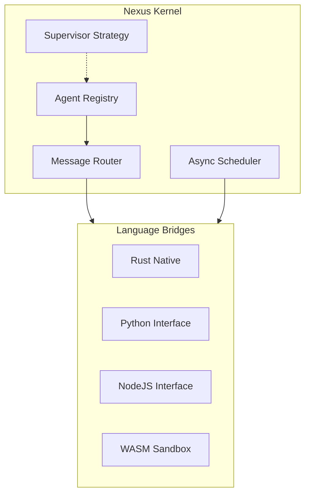

<div align="center">

# 🌌 Project Nexus

**The Universal Standard Kernel for Agentic AI**

[](https://github.com/ruslanmv/Nexus/actions)
[](https://github.com/ruslanmv/Nexus/actions)
[](https://opensource.org/licenses/Apache-2.0)
[](https://crates.io/crates/nexus)


<br/>

<p align="center">
  
  
  
  
</p>

**Nexus** is a production-grade async kernel for autonomous agents. Built in Rust with Tokio, it provides the execution substrate for spawning, supervising, and routing thousands of concurrent agents with deterministic behavior and operational safety.

[Quick Start](#quick-start) • [Documentation](#documentation) • [Features](#features) • [Examples](#examples) • [Contributing](#contributing)

</div>

---

## Why Nexus?

> *"Just as operating systems standardized on kernels to manage processes, memory, and I/O, Project Nexus defines the first universal Agent Kernel—a low-level, high-performance runtime that governs how autonomous agents are spawned, isolated, scheduled, and allowed to interact."*

### The Problem
In the rapidly evolving landscape of AI agents, teams often build infrastructure from scratch, leading to:
* **Reinventing the wheel:** No standard runtime for agent execution.
* **Inconsistent behavior:** Different frameworks resulting in different semantics.
* **Poor scalability:** Most solutions cannot handle thousands of concurrent agents.
* **Language silos:** Python agents cannot communicate effectively with JavaScript agents.
* **Lack of Isolation:** Agents can interfere with each other in shared memory spaces.

### The Solution
Nexus provides the **standard infrastructure layer** for agentic AI:
* **Universal Runtime:** Single kernel supporting Rust, Python, JavaScript, and WASM.
* **Battle-Tested:** Production-grade architecture designed for stability.
* **Massive Scale:** Capable of running 10,000+ concurrent agents on a single machine.
* **True Isolation:** WebAssembly sandboxing with strict resource limits.
* **Zero-Copy Messaging:** 50µs message latency with 100k+ messages/sec throughput.

---

## Features

### Core Capabilities

<table>
<tr>
<td width="50%">

#### High-Performance Execution
- **Launch thousands of agents** in milliseconds (~100µs per agent).
- **Message latency** under 50µs end-to-end.
- **Throughput** exceeding 100,000 messages/second.
- **Memory efficient** (only ~1KB overhead per agent).
- **Lock-free architecture** utilizing concurrent hashmap registries.

</td>
<td width="50%">

#### Secure Isolation
- **WebAssembly sandboxing** for untrusted code execution.
- **Resource limits** including memory, CPU fuel, and stack size.
- **Process isolation** preventing agent interference.
- **Capability-based security** model.
- **Audit logging** for enterprise compliance.

</td>
</tr>
<tr>
<td>

#### Multi-Language Support
- **Rust:** Native performance and safety.
- **Python:** Optimized for data science and AI workflows.
- **JavaScript/Node.js:** Seamless web integration.
- **WebAssembly:** Portable, sandboxed execution.
- **Zero serialization overhead** with efficient protocols.

</td>
<td>

#### Message-Based Communication
- **Type-safe messaging** with structured payloads.
- **Backpressure control** via bounded mailboxes.
- **Request-response patterns** built-in.
- **Broadcast and multicast** support.
- **Timeout enforcement** to prevent deadlocks.

</td>
</tr>
<tr>
<td>

#### Production Operations
- **Graceful shutdown** via SIGTERM/SIGINT handling.
- **Structured logging** with the `tracing` crate.
- **Metrics and monitoring** integration ready.
- **Systemd integration** for Linux deployments.
- **Configuration management** via TOML.

</td>
<td>

#### Distributed Runtime (v0.3.0)
- **Cluster coordination** across multiple nodes.
- **Agent discovery** and service mesh capabilities.
- **Load balancing** for agent distribution.
- **Fault tolerance** with supervisor trees.
- **Horizontal scaling** to thousands of machines.

</td>
</tr>
</table>

---

## Installation

### Quick Install (Recommended)

**Linux & macOS**
```bash
curl -sSL [https://raw.githubusercontent.com/ruslanmv/Nexus/main/install.sh](https://raw.githubusercontent.com/ruslanmv/Nexus/main/install.sh) | bash

```

**Using Cargo**

```bash
cargo install nexus-runtime

```

**From Release (Linux/macOS)**
Download pre-built binaries from [GitHub Releases](https://github.com/ruslanmv/Nexus/releases/latest).

```bash
# Linux (x86_64)
wget [https://github.com/ruslanmv/Nexus/releases/download/v0.3.0/nexus-v0.3.0-x86_64-unknown-linux-gnu.tar.gz](https://github.com/ruslanmv/Nexus/releases/download/v0.3.0/nexus-v0.3.0-x86_64-unknown-linux-gnu.tar.gz)
tar xzf nexus-v0.3.0-x86_64-unknown-linux-gnu.tar.gz
sudo mv nexus-v0.3.0-x86_64-unknown-linux-gnu/nexus-runtime /usr/local/bin/

```

### Docker

```bash
docker pull ghcr.io/ruslanmv/nexus:latest
docker run -it ghcr.io/ruslanmv/nexus:latest

```

### Package Managers

**Homebrew (macOS/Linux)**

```bash
brew tap ruslanmv/nexus
brew install nexus

```

**Debian/Ubuntu**

```bash
wget [https://github.com/ruslanmv/Nexus/releases/download/v0.3.0/nexus_0.3.0_amd64.deb](https://github.com/ruslanmv/Nexus/releases/download/v0.3.0/nexus_0.3.0_amd64.deb)
sudo dpkg -i nexus_0.3.0_amd64.deb

```

---

## Quick Start

### Basic Usage

```bash
# Run with default configuration
nexus-runtime

# Run with 100 agents for 60 seconds
nexus-runtime -n 100 -d 60

# Use custom configuration file
nexus-runtime --config /etc/nexus/config.toml

# Generate a configuration template
nexus-runtime --generate-config my-config.toml

```

### 30-Second Demo

```bash
# Clone and run the demo
git clone [https://github.com/ruslanmv/Nexus.git](https://github.com/ruslanmv/Nexus.git)
cd Nexus
make run

```

---

## Examples

### Rust Agent (Native)

```rust
use nexus::{Agent, Kernel, KernelConfig, Message, MessageKind};
use async_trait::async_trait;
use uuid::Uuid;
use serde_json::json;

struct WorkerAgent {
    id: Uuid,
    name: String,
}

#[async_trait]
impl Agent for WorkerAgent {
    fn id(&self) -> Uuid { self.id }
    fn name(&self) -> &str { &self.name }

    async fn handle_message(&self, msg: Message) -> Option<Message> {
        println!("Worker {} processing: {:?}", self.name, msg.payload);

        // Process the message
        let result = json!({"status": "completed", "worker": self.name});

        // Return response
        Some(Message::new(
            self.id,
            msg.from,
            MessageKind::Response,
            result
        ))
    }
}

```

### Python Agent

```python
#!/usr/bin/env python3
from nexus_bridge import NexusAgent, run_agent

class DataAnalyzer(NexusAgent):
    """AI-powered data analysis agent"""

    async def handle_message(self, message):
        action = message.payload.get('action')

        if action == 'analyze':
            data = message.payload.get('data', [])
            result = {
                'mean': sum(data) / len(data) if data else 0,
                'count': len(data),
            }
            return {'status': 'success', 'analysis': result}

        return {'error': 'Unknown action'}

if __name__ == '__main__':
    agent = DataAnalyzer("DataAnalyzer-1")
    run_agent(agent)

```

### JavaScript Agent

```javascript
const { NexusAgent, runAgent } = require('./bridges/javascript/nexus-bridge');

class APIGateway extends NexusAgent {
    constructor(name) {
        super(name);
        this.requestCount = 0;
    }

    async handleMessage(message) {
        const { method, path } = message.payload;
        this.requestCount++;
        
        console.log(`[${this.name}] ${method} ${path}`);
        
        if (path === '/health') {
            return { status: 'healthy', uptime: process.uptime() };
        }
        return { error: 'Not Found', code: 404 };
    }
}

const gateway = new APIGateway('APIGateway-1');
runAgent(gateway);

```

---

## Architecture

Nexus follows the **Actor Model** and draws inspiration from Erlang/OTP.



### Performance Characteristics

| Metric | Value | Notes |
| --- | --- | --- |
| **Agent Spawn** | ~100µs | Per agent creation time |
| **Message Latency** | ~50µs | End-to-end delivery |
| **Throughput** | 100k+ msg/s | Single machine |
| **Concurrency** | 10,000+ agents | Tested at scale |
| **Memory Overhead** | ~1KB/agent | Minimal footprint |

---

## Configuration

Nexus uses **TOML** configuration files.

```toml
[kernel]
mailbox_capacity = 1024       # Messages per agent mailbox
send_timeout_ms = 500         # Timeout for sending messages

[logging]
level = "info"                # trace, debug, info, warn, error
format = "json"               # Recommended for production

[runtime]
worker_threads = 0            # 0 = auto-detect CPU count

[wasm]
enabled = true                # Enable WASM support
max_memory_mb = 256           # Per-agent memory limit

```

---

## Production Deployment

### Kubernetes (Helm/Manifests)

```yaml
apiVersion: apps/v1
kind: Deployment
metadata:
  name: nexus
spec:
  replicas: 3
  selector:
    matchLabels:
      app: nexus
  template:
    metadata:
      labels:
        app: nexus
    spec:
      containers:
      - name: nexus
        image: ghcr.io/ruslanmv/nexus:latest
        ports:
        - containerPort: 7946
        resources:
          limits:
            memory: "2Gi"
            cpu: "2000m"

```

### Systemd Service

```bash
sudo make deploy
sudo systemctl start nexus

```

---

## Documentation

* [Getting Started Guide](https://www.google.com/search?q=docs/getting-started.md)
* [Agent Development](https://www.google.com/search?q=docs/agent-development.md)
* [Multi-Language Bridges](https://www.google.com/search?q=bridges/README.md)
* [Configuration Reference](https://www.google.com/search?q=docs/configuration.md)
* [Deployment Guide](https://www.google.com/search?q=docs/deployment.md)
* [API Reference (Rust)](https://docs.rs/nexus)

---

## Use Cases

* **AI Agent Orchestration:** Deploy and coordinate multiple AI agents (LLM-based, ML models) with guaranteed message delivery.
* **Microservices Backend:** Lightweight alternative to service meshes for microservice communication.
* **Workflow Automation:** Build complex, stateful workflows where each step is an isolated agent.
* **Real-Time Data Processing:** Process streaming data with agent pipelines scaling across machines.

---

## Why Choose Nexus?

### Comparison with Alternatives

| Feature | Nexus | Ray | Akka | Orleans | Dapr |
| --- | --- | --- | --- | --- | --- |
| **Language Support** | Rust, Py, JS, WASM | Python-first | JVM only | .NET only | Multi-language |
| **Latency** | Sub-100µs | ML-focused | Low | Low | Network overhead |
| **Memory Footprint** | ~1KB/agent | Heavy | JVM heap | CLR overhead | Sidecar model |
| **WASM Support** | Native | No | No | No | Via plugins |
| **External Deps** | None (Single Binary) | Python runtime | JVM | .NET | Kubernetes |

---

## Roadmap

### Version 0.3.0 (Current)

* [x] WebAssembly agent isolation
* [x] Python language bridge
* [x] JavaScript language bridge
* [x] Distributed agent registry

### Version 0.4.0 (Q2 2026)

* [ ] Service mesh and agent discovery
* [ ] Built-in metrics (Prometheus)
* [ ] Persistent agent state (Redis/PostgreSQL)
* [ ] gRPC support for inter-agent communication

### Version 0.5.0 (Q3 2026)

* [ ] Multi-node clustering with Raft consensus
* [ ] Resource quotas and limits per agent
* [ ] Web UI for monitoring and debugging

---

## Contributing

We welcome contributions from the community. Please read our [CONTRIBUTING.md](https://www.google.com/search?q=CONTRIBUTING.md) for detailed guidelines.

1. Fork the repository
2. Create a feature branch (`git checkout -b feature/amazing-feature`)
3. Commit your changes
4. Push to the branch
5. Open a Pull Request

---

## 📜 License

Project Nexus is licensed under the **Apache License 2.0**.

This means:
- ✅ Commercial use allowed
- ✅ Modification allowed
- ✅ Distribution allowed
- ✅ Patent grant included
- ✅ Private use allowed

See [LICENSE](LICENSE) file for full terms.
See [SECURITY.md](SECURITY.md) for our security policy and supported versions.

---

## 🙏 Acknowledgments

Nexus stands on the shoulders of giants:

- **[Tokio](https://tokio.rs/)** - The async runtime powering Nexus
- **[Wasmtime](https://wasmtime.dev/)** - WebAssembly runtime for agent isolation
- **[DashMap](https://github.com/xacrimon/dashmap)** - Lock-free concurrent hashmap
- **Erlang/OTP** - Inspiration for supervision and actor model
- **Kubernetes** - Orchestration patterns and best practices


## 📚 Citation

If you use Nexus in your research or project, please cite:

```bibtex
@software{nexus2026,
  title = {Nexus: The Universal Standard Kernel for Agentic AI},
  author = {Ruslan Magana Vsevolodovna},
  year = {2026},
  url = {https://github.com/ruslanmv/Nexus},
  version = {0.3.0},
  license = {Apache-2.0}
}
```

---

<div align="center">

**⭐ Star us on GitHub — it helps!**

[🌟 Star](https://github.com/ruslanmv/Nexus/stargazers) • [🔗 Fork](https://github.com/ruslanmv/Nexus/fork) • [📥 Download](https://github.com/ruslanmv/Nexus/releases)

**Project Nexus** - *The Linux Kernel of Agentic Intelligence*

Made with ❤️ by the Nexus community

</div>
